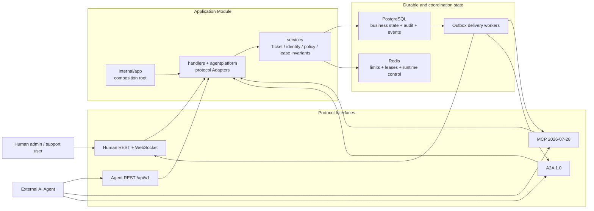

# ChronoDesk Architecture

ChronoDesk is a modular monolith for a single organization. Human REST, Agent
REST, MCP, and A2A are protocol Adapters over the same Ticket, identity, policy,
lease, event, and audit Implementation.

Read [CONTEXT.md](CONTEXT.md) first for the domain language and invariants.

## Runtime flow



## Repository map

```text
.
├── server/
│   ├── cmd/chronodesk/       # minimal executable entry
│   ├── cmd/migrate/          # explicit schema/seed command
│   ├── cmd/credential-maintain/ # validate, rotate, or quarantine credentials
│   └── internal/
│       ├── app/              # composition root and lifecycle
│       ├── agentcontract/    # protocol-neutral scopes and machine contracts
│       ├── eventcontract/    # canonical CloudEvent type catalog
│       ├── services/         # domain/application rules
│       ├── models/           # persistence records and Actor value types
│       ├── handlers/         # human REST Adapters
│       ├── agentplatform/    # Agent REST and MCP/A2A domain Adapters
│       ├── agentauth/        # machine OAuth tokens and resources
│       ├── mcp/              # MCP protocol Module
│       ├── a2a/              # A2A protocol Module
│       ├── openapi/          # embedded machine contract Module
│       ├── security/         # keyring and outbound callback protection
│       └── database/         # PostgreSQL/Redis bootstrap and migrations
├── web/                      # React Admin enterprise UI
├── docs/                     # maintained guides, reference, ADRs, reports
└── .github/                  # contribution, security, CI, and automation
```

## Dependency rules

These rules preserve Module Depth and domain Locality:

1. `services` and `models` do not import MCP, A2A, OpenAPI, HTTP handlers, or
   `agentplatform`.
2. Protocol Modules do not import human REST handlers.
3. Protocol Adapters translate transport types and errors; they do not own
   Ticket, Assignment, policy, lease, idempotency, or audit rules.
4. `openapi` is consumed by the `app` composition root and its own contract
   tests, not by domain Modules.
5. PostgreSQL business changes and Domain Events commit atomically. Delivery
   happens only through Outbox Deliveries.
6. External callbacks use the pinned, no-proxy, no-redirect HTTPS Adapter in
   `internal/security`; no feature creates an ad-hoc HTTP client for untrusted
   destinations.

`server/internal/architecture/dependencies_test.go` enforces the static import
portion of these rules.

## Interface strategy

- Prefer a small Interface that exposes a complete domain operation.
- Introduce a Seam only when at least two Adapters vary at that point.
- Test through the same Interface used by callers.
- Apply the deletion test before adding or retaining a Module. Removing a
  pass-through Module should reduce surface area; removing an Adapter must not
  erase business behavior.

## Consistency and concurrency

- Ticket writes use optimistic versions (`ETag` / `If-Match`).
- Agent-critical writes additionally require a valid Ticket Lease.
- `Idempotency-Key` binds the caller, operation, request digest, and original
  Operation Receipt.
- Human, Service Principal, and system writes share `ActorRef` and immutable
  audit/event metadata.
- CloudEvents and Outbox records are recoverable after process termination.

## Security posture

- Human and machine credentials use separate issuers/resources and storage.
- MCP, Agent REST, and A2A tokens have distinct audiences.
- Attachment content is size-limited, hashed, scan-state gated, and authorized
  on download.
- User-controlled content is data, never instructions.
- Runtime controls include global and per-principal read-only/emergency stops,
  rate/concurrency limits, and loop detection.

## Decisions and future changes

Accepted decisions live in [`docs/adr/`](docs/adr/). Large domain package moves,
multi-tenancy, an A2A client, embedded models, and knowledge retrieval require
separate ADRs and focused pull requests.
