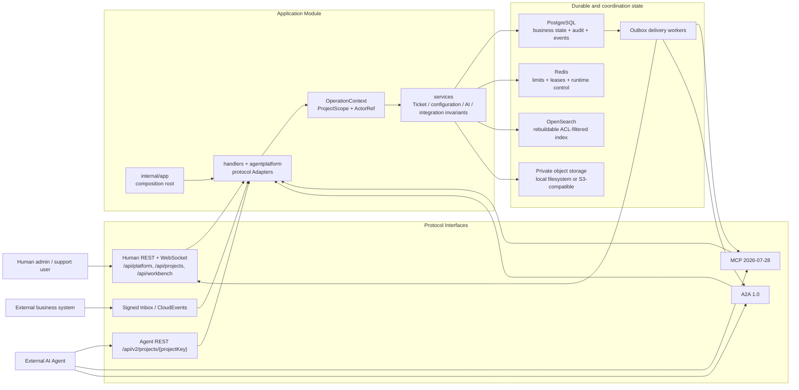

# ChronoDesk Architecture

ChronoDesk is an AI-native, multi-project modular monolith for a single private
Organization. Human REST, Agent REST, MCP, A2A, and Connector Adapters are
protocol projections over the same project-scoped Ticket, identity, policy,
lease, configuration, integration, knowledge, event, and audit
Implementations.

Read [CONTEXT.md](CONTEXT.md) first for the domain language and invariants.

## Runtime flow



## Repository map

```text
.
├── server/
│   ├── cmd/chronodesk/       # minimal executable entry
│   ├── cmd/migrate/          # explicit schema/seed command
│   ├── cmd/credential-maintain/ # validate, rotate, or quarantine credentials
│   ├── cmd/chronodeskctl/     # connection and contract diagnostics
│   └── internal/
│       ├── app/              # composition root and lifecycle
│       ├── agentcontract/    # protocol-neutral scopes and machine contracts
│       ├── eventcontract/    # canonical CloudEvent type catalog
│       ├── services/         # domain/application rules
│       ├── models/           # persistence records and Actor value types
│       ├── handlers/         # human REST Adapters
│       ├── agentplatform/    # Agent REST and MCP/A2A domain Adapters
│       ├── agentauth/        # machine OAuth tokens and resources
│       ├── mcp/              # MCP protocol Module
│       ├── a2a/              # A2A protocol Module
│       ├── openapi/          # embedded machine contract Module
│       ├── asyncapi/         # embedded CloudEvents/stream contract Module
│       ├── observability/    # trace context, metrics, and telemetry lifecycle
│       ├── security/         # keyring and outbound callback protection
│       └── database/         # PostgreSQL/Redis bootstrap and migrations
├── web/                      # React Admin enterprise UI
├── docs/                     # maintained guides, reference, ADRs, reports
└── .github/                  # contribution, security, CI, and automation
```

## Dependency rules

These rules preserve Module Depth and domain Locality:

1. `services` and `models` do not import MCP, A2A, OpenAPI, HTTP handlers, or
   `agentplatform`.
2. Protocol Modules do not import human REST handlers.
3. Protocol Adapters translate transport types and errors; they do not own
   Ticket, Assignment, policy, lease, idempotency, or audit rules.
4. `openapi` is consumed by the `app` composition root and its own contract
   tests, not by domain Modules.
5. PostgreSQL business changes and Domain Events commit atomically. Delivery
   happens only through Outbox Deliveries.
6. External callbacks use the pinned, no-proxy, no-redirect HTTPS Adapter in
   `internal/security`; no feature creates an ad-hoc HTTP client for untrusted
   destinations.
7. Every project-owned Repository, statistic, SLA calculation, automation,
   index operation, and Worker accepts an explicit `ProjectScope`.
8. A public project key becomes a numeric scope only after membership or
   Principal Grant authorization. A request body, custom field, or A2A
   `tenant` value never supplies scope.
9. Project-owned PostgreSQL tables use `ENABLE` and `FORCE ROW LEVEL
   SECURITY`; the application role is neither the owner nor `BYPASSRLS`.
10. Human, Service Principal, Connector, and system writes share
    `OperationContext`, `ActorRef`, version, idempotency, event, and audit
    semantics.

`server/internal/architecture/dependencies_test.go` enforces the static import
portion of these rules.

## Interface strategy

- Prefer a small Interface that exposes a complete domain operation.
- Introduce a Seam only when at least two Adapters vary at that point.
- Test through the same Interface used by callers.
- Apply the deletion test before adding or retaining a Module. Removing a
  pass-through Module should reduce surface area; removing an Adapter must not
  erase business behavior.

## Consistency and concurrency

- Ticket writes use optimistic versions (`ETag` / `If-Match`).
- Agent-critical writes additionally require a valid Ticket Lease.
- `Idempotency-Key` binds the caller, operation, request digest, and original
  Operation Receipt.
- Human, Service Principal, and system writes share `ActorRef` and immutable
  audit/event metadata.
- CloudEvents and Outbox records are recoverable after process termination.

## Security posture

- Human and machine credentials use separate issuers/resources and storage.
- MCP, Agent REST, and A2A tokens have distinct audiences.
- OAuth client-credential tokens bind exactly one Project and one audience.
- A Human JWT carries only `PlatformRole`, which is revalidated against the
  active identity for every request. `ProjectRole` is resolved from active
  Membership for each project request and never inherited from a platform role.
- `/api/platform/*` provides explicit platform governance; `/api/projects/*`
  requires one resolved ProjectScope; `/api/workbench/*` aggregates only active
  Membership scopes. The Human Web contract at `/human-openapi.json` documents
  that boundary without becoming an Agent machine contract.
- Project membership/grant checks and PostgreSQL RLS independently prevent
  cross-project reads and writes.
- Attachment and authored-knowledge objects use one private storage Interface:
  local filesystem is the default and S3-compatible storage is an operator
  choice. Logical keys, hashes, MIME metadata, scan state, and Project scope
  stay authoritative in PostgreSQL; callers never receive bucket credentials
  or durable public object URLs.
- Attachment content is size-limited, content-sniffed, hashed, scan-state
  gated, and authorized on download. Browser preview is explicit, bounded, and
  fail-closed by type; parsing or conversion belongs in an isolated Worker.
- Knowledge publication is Human-gated. Service Principals can search
  authorized published sections and submit attributable drafts, but no machine
  Adapter exposes a publication command.
- User-controlled content is data, never instructions.
- Runtime controls include global and per-principal read-only/emergency stops,
  rate/concurrency limits, and loop detection.
- Agent actions use risk obligations, immutable Proposals, expiring Approvals,
  and atomic human takeover.
- Integration ingress uses timestamped signatures, replay protection,
  idempotent Inbox receipts, immutable Mapping Versions, and an Outbox.
- Audit ledger entries form a per-project tamper-evident hash chain.

## Decisions and future changes

Accepted decisions live in [`docs/adr/`](docs/adr/). Large domain package moves,
SaaS multi-tenancy, multi-region writes, customer-branded portals, MSP
delegation, and embedded model runtimes require separate ADRs and focused pull
requests. They must not weaken the Project boundary established here.
