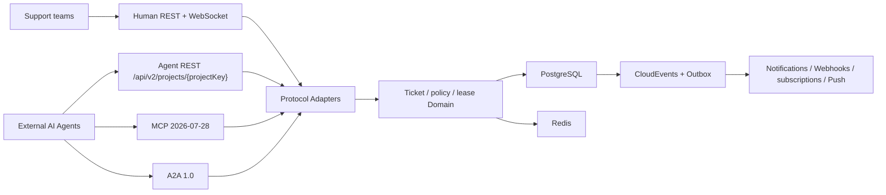

# ChronoDesk

[简体中文](README.zh-CN.md) · English

[](https://github.com/seaworld008/chronodesk/actions/workflows/smoke.yml)
[](https://github.com/seaworld008/chronodesk/actions/workflows/security.yml)
[](https://github.com/seaworld008/chronodesk/actions/workflows/codeql.yml)
[](LICENSE)

ChronoDesk is an AI-agent-native ticket and task execution platform for teams
that need trustworthy human-agent collaboration across support, IT service,
SRE, security operations, internal services, and field operations. Humans work
in a Chinese enterprise console; external Agents use stable REST, MCP, or A2A
Interfaces backed by the same authorization, concurrency, event, and audit
semantics.

The project is a single-organization, self-hosted modular monolith. It does not
embed an LLM, RAG system, prompt platform, or autonomous planner.

## Why ChronoDesk

- **One Ticket domain, four Interfaces**: human REST/WebSocket, Agent REST,
  MCP, and A2A share the same domain Implementation.
- **Machine identity is first-class**: Service Principals, short-lived tokens,
  minimum scopes, policy decisions, rate/concurrency limits, emergency stops,
  and delegated audit trails.
- **Safe concurrent automation**: `Idempotency-Key`, optimistic versions,
  `ETag` / `If-Match`, and expiring Ticket Leases.
- **Recoverable event delivery**: CloudEvents 1.0 Domain Events and a
  transactional Outbox with retry, replay, deduplication, and observability.
- **Untrusted-content discipline**: comments, attachments, filenames, and Agent
  payloads are always data, never control instructions.
- **Enterprise console**: Chinese interaction copy, object-level permissions,
  no-wrap/resizable tables, persisted widths, responsive navigation, SLA,
  automation, notifications, Webhooks, and Agent operations.

## Use cases and industries

ChronoDesk is broader than a traditional support desk. If work can be expressed
as “intake → triage and assignment → execution → information gathering →
review or escalation → completion,” a Ticket can coordinate humans, AI Agents,
and enterprise systems in one auditable workflow.

| Industry or team | Typical use cases |
| --- | --- |
| IT and software | Service desk, access requests, bugs, cloud resources, alerts, incidents, and changes |
| Support, retail, and commerce | After-sales support, complaints, refunds, logistics exceptions, suppliers, and VIP escalation |
| Manufacturing, energy, and facilities | Equipment faults, quality exceptions, inspections, repairs, spare parts, and maintenance records |
| Finance, insurance, and professional services | Complaints, document checks, claims assistance, risk investigation, legal, and finance requests |
| Healthcare, education, and public service | Equipment operations, administration, student or citizen requests, document routing, and supervision |
| Data and content operations | Content review, data-quality issues, labeling tasks, and exception remediation |
| Enterprise shared services | HR, administration, procurement, finance, compliance, and cross-team requests |

ChronoDesk is a particularly good fit when:

- status, ownership, and escalation paths are explicit, with SLA, notification,
  and audit requirements;
- AI must query and execute real operations instead of only drafting text;
- multiple humans or Agents may work concurrently and need idempotency,
  versions, and Ticket Leases;
- automation must coexist with least privilege, policy, circuit breakers, and
  human takeover.

## Human-agent collaboration

ChronoDesk supports several operating models, from assistance to policy-bound
autonomy:

1. **AI assists humans**: classify, summarize, complete fields, and recommend
   assignees or replies while a human decides what to execute.
2. **AI handles first, humans take over**: an Agent performs initial diagnosis
   and escalates when confidence, information, or permission is insufficient.
3. **AI acts autonomously within policy**: an Agent can claim a Ticket, add
   comments, transition status, and release its lease. Scopes, policies,
   limits, versions, leases, and circuit breakers constrain risk.
4. **Humans supervise multiple Agents**: administrators inspect identities,
   credentials, policy decisions, live leases, event delivery, and audit trails,
   and can disable an Agent, enter read-only mode, or take over.
5. **Agent-to-Agent collaboration**: MCP exposes Ticket tools while A2A carries
   tasks, messages, status, and Artifacts. Every participant remains anchored
   to the same business Ticket.

```text
Email / alert / human / external Agent creates a Ticket
→ AI classifies, prioritizes, and claims it
→ automation resolves it or requests more information
→ low-risk operations complete within policy
→ high-risk, exceptional, or low-confidence work escalates to a human
→ completion, notification, and a reconstructable audit trail
```

### Current boundaries

- The current deployment model is single-organization and self-hosted. Models,
  RAG, and autonomous planning live in an external Agent platform.
- ChronoDesk can coordinate exceptions produced by real-time control, clinical,
  trading, or other specialist systems, but it does not replace those systems
  or their professional decisions.
- Multi-tenancy, billing, embedded models, knowledge retrieval, and outbound
  delegation are later phases.

## Current protocol baseline

ChronoDesk intentionally supports only the current protocol line:

| Interface | Version |
| --- | --- |
| MCP | `2026-07-28`, stateless Streamable HTTP |
| A2A | official release `v1.0.1`, wire `A2A-Version: 1.0` |
| OpenAPI | `3.2.0` |
| CloudEvents | `1.0` |

There are no legacy MCP sessions, downgraded schemas, or old A2A method aliases.

## Architecture



Read [ARCHITECTURE.md](ARCHITECTURE.md) for the Module map and dependency rules,
and [CONTEXT.md](CONTEXT.md) for the domain language expected in code and docs.

## 60-second local demo

Requirements: Docker with Compose v2.

```bash
git clone https://github.com/seaworld008/chronodesk.git
cd chronodesk
make dev
docker compose exec server chronodesk-migrate -seed
```

Open:

- Console: <http://localhost:3000>
- Health: <http://localhost:8081/healthz>
- OpenAPI: <http://localhost:8081/openapi.yaml>
- Agent REST: `http://localhost:8081/api/v2/projects/{projectKey}`
- MCP: <http://localhost:8081/mcp>
- A2A Agent Card: <http://localhost:8081/.well-known/agent-card.json>

The Compose credentials and secrets are development-only. Never reuse them in a
shared or production environment.

Stop and remove the local services with:

```bash
make docker-down
```

## Native development

Requirements:

- Go `1.26.5`
- Node.js `24`
- Python `3.12+`
- PostgreSQL `18`
- Redis `8`

```bash
make doctor
cp server/.env.example server/.env
make install-deps
make db-migrate-seed
```

Run the API and Web console in separate terminals:

```bash
make server-dev
make web-dev
```

Local secrets belong in ignored `.env` files or an external secret manager.

## Quality gates

```bash
make test          # Go tests/vet, Web type/lint/audit, OpenAPI lint
make security      # govulncheck and Web production dependency policy
make build         # API, migration binary, and production Web assets
make test-race     # Go race detector
make smoke         # all black-box API suites against a running environment
make e2e           # Playwright browser suite against a running environment
make verify        # complete local release gate
```

CI also runs CodeQL, secret scanning/push protection, dependency updates, and
the Docker-backed smoke path.

## Repository layout

```text
server/
  cmd/chronodesk/       minimal executable
  cmd/migrate/          explicit migration/seed command
  cmd/credential-maintain/ current-format validation, rotation, and quarantine
  internal/app/         composition root and graceful lifecycle
  internal/services/    shared domain/application rules
  internal/agentplatform/
                        Agent REST and MCP/A2A domain Adapters
  internal/mcp/         MCP protocol Module
  internal/a2a/         A2A protocol Module
  internal/openapi/     embedded OpenAPI 3.2 contract
web/
  src/admin/            React Admin feature slices
  src/components/       shared enterprise UI Modules
docs/
  adr/                  accepted architecture decisions
  operations/           deployment and migration guides
  reference/            protocol and machine-contract references
  testing/              durable verification reports
```

## Documentation

- [Project manual](docs/PROJECT_MANUAL.md)
- [Architecture decisions](docs/adr/README.md)
- [Agent REST and machine contract](docs/reference/API_DOCUMENTATION.md)
- [MCP integration](docs/reference/MCP_2026_07_28.md)
- [A2A integration](docs/reference/A2A_1_0.md)
- [Database migrations](docs/operations/database-migrations.md)
- [Testing guide](docs/testing_guide.md)
- [Full Agent-native verification report](docs/testing/CHRONODESK_AGENT_NATIVE_FULL_TEST_REPORT_2026-07-30.md)

## Project status

ChronoDesk is in active pre-1.0 development. Protocol contracts and security
invariants are tested, but release compatibility is not promised until the
first stable release. See [ROADMAP.md](ROADMAP.md) and
[CHANGELOG.md](CHANGELOG.md).

## Contributing and security

Read [CONTRIBUTING.md](CONTRIBUTING.md) before opening a pull request. Use
[GitHub Discussions](https://github.com/seaworld008/chronodesk/discussions) for
design questions and [GitHub Issues](https://github.com/seaworld008/chronodesk/issues)
for reproducible defects.

Do not report vulnerabilities in a public issue. Follow
[SECURITY.md](SECURITY.md) and submit a
[private security advisory](https://github.com/seaworld008/chronodesk/security/advisories/new).

## License

Licensed under the [Apache License 2.0](LICENSE).
