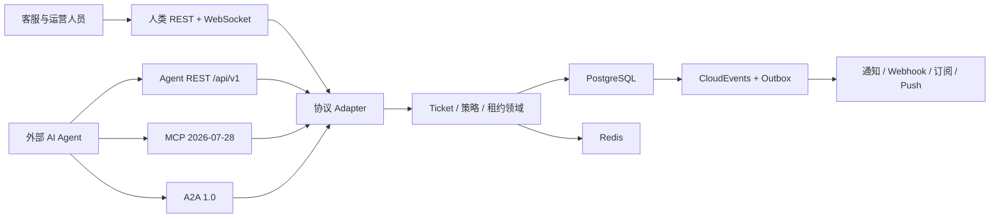

# ChronoDesk

简体中文 · [English](README.md)

[](https://github.com/seaworld008/chronodesk/actions/workflows/smoke.yml)
[](https://github.com/seaworld008/chronodesk/actions/workflows/security.yml)
[](https://github.com/seaworld008/chronodesk/actions/workflows/codeql.yml)
[](LICENSE)

ChronoDesk 是面向客服和运营团队的 AI Agent 原生工单自动化平台。人类在全中文
企业管理后台中工作；外部 Agent 通过稳定的 REST、MCP 或 A2A Interface 接入，
并共享完全一致的权限、并发控制、事件和审计语义。

项目采用面向单组织私有化部署的模块化单体架构，不内置 LLM、RAG、提示词平台或
自治规划器。

## 为什么选择 ChronoDesk

- **一套 Ticket 领域，四种 Interface**：人类 REST/WebSocket、Agent REST、
  MCP 与 A2A 共用同一领域 Implementation。
- **机器身份是一等公民**：Service Principal、短期令牌、最小 scope、策略决策、
  限流/并发限制、紧急停用和完整委托审计。
- **并行自动化安全**：`Idempotency-Key`、资源版本、`ETag` / `If-Match` 和
  有时效的 Ticket Lease。
- **事件投递可恢复**：CloudEvents 1.0 Domain Event 与事务 Outbox 支持重试、
  回放、去重和可观测。
- **不可信内容隔离**：评论、附件、文件名和 Agent payload 永远是数据，不是控制指令。
- **企业管理体验**：全中文提示、对象级权限、不换行且可调列宽的表格、SLA、
  自动化、通知、Webhook 与 Agent 控制中心。

## 当前协议基线

ChronoDesk 只支持当前协议版本：

| Interface | 版本 |
| --- | --- |
| MCP | `2026-07-28`，无状态 Streamable HTTP |
| A2A | 官方发布 `v1.0.1`，线协议 `A2A-Version: 1.0` |
| OpenAPI | `3.2.0` |
| CloudEvents | `1.0` |

系统不保留旧 MCP Session、降级 Schema 或旧 A2A 方法别名。

## 架构



模块结构与依赖规则见 [ARCHITECTURE.md](ARCHITECTURE.md)，统一领域语言见
[CONTEXT.md](CONTEXT.md)。

## 60 秒本地体验

环境要求：Docker 与 Compose v2。

```bash
git clone https://github.com/seaworld008/chronodesk.git
cd chronodesk
make dev
docker compose exec server chronodesk-migrate -seed
```

访问：

- 管理后台：<http://localhost:3000>
- 健康检查：<http://localhost:8081/healthz>
- OpenAPI：<http://localhost:8081/openapi.yaml>
- Agent REST：<http://localhost:8081/api/v1>
- MCP：<http://localhost:8081/mcp>
- A2A Agent Card：<http://localhost:8081/.well-known/agent-card.json>

Compose 中的账号和密钥只用于本地开发，严禁复用于共享或生产环境。

停止环境：

```bash
make docker-down
```

## 原生开发

环境要求：Go `1.26.5`、Node.js `24`、Python `3.12+`、PostgreSQL `18`、
Redis `8`。

```bash
make doctor
cp server/.env.example server/.env
make install-deps
make db-migrate-seed
```

分别启动前后端：

```bash
make server-dev
make web-dev
```

本地凭据只能写入已忽略的 `.env` 或外部密钥管理系统。

## 质量门禁

```bash
make test          # Go 测试/vet、Web 类型/lint/audit、OpenAPI lint
make security      # govulncheck 与 Web 生产依赖安全策略
make build         # API、迁移二进制和 Web 生产资源
make test-race     # Go 竞态检测
make smoke         # 对运行环境执行全部 Python 黑盒测试
make e2e           # 对运行环境执行 Playwright 浏览器测试
make verify        # 完整本地发布门禁
```

CI 还会执行 CodeQL、秘密扫描/推送保护、依赖自动更新和 Docker 冒烟流程。

## 仓库结构

```text
server/
  cmd/chronodesk/       最小可执行入口
  cmd/migrate/          显式迁移/种子命令
  internal/app/         组合根与优雅生命周期
  internal/services/    共享领域/应用规则
  internal/agentplatform/
                        Agent REST 与 MCP/A2A 领域 Adapter
  internal/mcp/         MCP 协议 Module
  internal/a2a/         A2A 协议 Module
  internal/openapi/     内嵌 OpenAPI 3.2 契约
web/
  src/admin/            React Admin 功能切片
  src/components/       共享企业 UI Module
docs/
  adr/                  已接受的架构决策
  operations/           运维与迁移指南
  reference/            协议与机器契约参考
  testing/              可持久复查的验证报告
```

## 文档

- [项目权威手册](docs/PROJECT_MANUAL.md)
- [架构决策](docs/adr/README.md)
- [Agent REST 与机器契约](docs/reference/API_DOCUMENTATION.md)
- [MCP 接入](docs/reference/MCP_2026_07_28.md)
- [A2A 接入](docs/reference/A2A_1_0.md)
- [数据库迁移](docs/operations/database-migrations.md)
- [测试指南](docs/testing_guide.md)
- [Agent 原生化完整测试报告](docs/testing/CHRONODESK_AGENT_NATIVE_FULL_TEST_REPORT_2026-07-29.md)

## 项目状态

ChronoDesk 当前处于活跃的 pre-1.0 阶段。协议契约和安全不变量已有测试保护，但首个
稳定版发布前不承诺版本兼容。详见 [ROADMAP.md](ROADMAP.md) 与
[CHANGELOG.md](CHANGELOG.md)。

## 贡献与安全

提交 PR 前请阅读 [CONTRIBUTING.md](CONTRIBUTING.md)。设计问题使用
[GitHub Discussions](https://github.com/seaworld008/chronodesk/discussions)，
可复现缺陷使用 [GitHub Issues](https://github.com/seaworld008/chronodesk/issues)。

禁止通过公开 Issue 报告安全漏洞。请按 [SECURITY.md](SECURITY.md) 提交
[私密安全公告](https://github.com/seaworld008/chronodesk/security/advisories/new)。

## 许可证

项目使用 [Apache License 2.0](LICENSE)。
