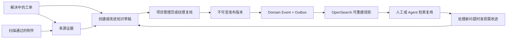

# 项目知识库：工单驱动的解决方案沉淀

## 产品定位

ChronoDesk 的知识库不是通用博客或企业 CMS，而是项目内的“可复用解决方案
库”。内容从真实工单处理过程中产生，保留工单、附件、版本、作者和发布者的
可追溯关系，并用于后续人工处理和 AI Agent 检索。

首版只解决四个高频问题：

1. 工单解决后没有形成可复用方案。
2. 文章与原始问题、证据附件脱节，过一段时间无法验证。
3. 知识条目结构不一致，检索命中后仍难以执行。
4. AI 直接改正式知识容易产生幻觉、越权和不可审计内容。

因此 canonical 入口位于“项目运营 → 知识库”。所有项目成员可搜索和阅读
其 ACL 允许的已发布文章；项目管理员和经理在同一页面完成全量草稿复核、
版本查看和发布。项目设置不复制日常知识入口；模型与摄取策略在首阶段由部署
配置和内部 Worker 管理，避免为了低频高级能力扩张后台界面。

## 文章模板

人工或 Agent 创建的 Markdown 草稿使用一个克制的默认模板：

```markdown
## 现象

## 适用范围

## 原因

## 解决步骤

## 验证

## 避免复发
```

模板强调可执行信息，不要求长篇叙述。标题层级会成为 `SectionPath`，发布后
按章节写入 PostgreSQL `KnowledgeChunk`，再投影到 OpenSearch。

## Solve Loop



这与 KCS 的核心思路一致：在解决请求的当下捕获知识，采用简单结构，并在
复用时持续校正，而不是事后组织一次“大规模文档工程”。

## 数据与版本边界

- PostgreSQL 是文章、ACL、版本、章节、引用、反馈和来源关系的权威源。
- 原始 Markdown 或导入文档是私有不可变对象，使用统一 AttachmentStorage，
  默认本地目录，也可写入 S3/MinIO。
- `KnowledgeArticleVersion` 只保存对象引用、hash 和扫描状态；正文不会作为
  未受控 Blob 塞入版本行。
- 系统自产 Markdown 会同时冻结非敏感 `store_id` 和对象存储返回的精确
  VersionID；切换 S3 bucket/prefix 后仍从原 store 读取，授权重验失败时也只
  删除刚写入的精确版本。旧版本没有 store_id 时仅在 provider 唯一可解析时
  兼容，多代同类型 store 会 fail closed。
- 系统自产 Markdown 在跨对象存储写入前先提交
  `KnowledgeObjectWriteIntent`。意图冻结项目、文章/版本 UUID、目标
  `store_id`、唯一对象键、大小和 SHA-256；对象存储返回后再补写精确
  VersionID。知识文章、版本、来源、章节、事件和 Outbox 的主事务会持锁核对
  该回执，并在同一事务删除意图，表示 PostgreSQL 已正式接管对象。
- 如果进程在 `PutObject` 成功后、VersionID 回写前退出，意图仍拥有这个从未
  发布过的 UUID 对象键。恢复 Worker 会从原 `store_id` 对应的历史 backend
  枚举该键的 S3 versions 和 delete markers，将每个 VersionID 先持久化到
  意图，再逐个精确删除；不会用无 VersionID 的 DeleteObject 制造删除标记，
  也不会误删切换后的 primary store。未启用版本控制的 S3 和默认本地存储按
  唯一键幂等删除。
- 同步回滚删除失败时只把固定失败码写入数据库，不保存 endpoint、bucket、
  凭据或 SDK 原始错误。后台恢复每次最多领取 100 个意图，每个项目单独运行，
  使用 `SKIP LOCKED`、两分钟租约、单调 fencing token 和指数退避；进程重启、
  租约过期或删除后数据库短暂失败都可以安全重试。活动和已归档项目都进入
  清理范围，成功提交的版本因为意图已在主事务中删除，永远不会被 sweeper
  选中。
- 底层“登记已有文件”命令只接受 provider、bucket、key、外部版本标识和
  hash，不接受部署内部的 store_id；该能力不暴露给首阶段 Human API，浏览器
  客户端不能把任意 bucket 伪装成已注册存储代际。
- `KnowledgeSourceLink` 绑定某个不可变版本与来源工单/附件，同时保存工单号、
  标题、附件名和 hash 快照；这些完整快照只用于不可变审计，不直接作为 API
  响应。正文接口按实时来源权限投影有界的 `KnowledgeSourceView`：有权时为
  `full`，撤权时为 `restricted`，来源删除、隔离或不再安全时为
  `unavailable`，文章本身不因来源变化而失效。
- 发布版本不可变。修改总是创建新草稿，发布后旧版进入 superseded；首阶段
  “发布”同时原子授予当前项目全员读取权限，因此贡献者提交的文章经复核后会
  立即进入普通成员浏览与检索范围，不会成为只有作者看得到的“幽灵文章”。
- 版本状态、文章当前版本、项目读取 ACL、
  `io.chronodesk.knowledge.version.published.v1` 领域事件和索引重建
  Outbox 在同一事务提交；事件或 Outbox 写入失败会回滚整次发布。
- 创建草稿时按工单号或标题执行服务端远程搜索，只返回当前项目内实时有权查看的
  工单；附件候选也只来自该工单中扫描为 `clean` 的有权附件。选择器最多保留
  20 个附件，并明确显示已选数量。
- 人类管理端的版本目录只展示创建者类别（人工、Agent 或系统），不返回内部
  Actor ID。Agent 机器契约不扩展该内部元数据。
- OpenSearch 只收录 `published + clean + ACL` 允许的章节，索引可随时从
  PostgreSQL 重建。
- 未配置受批准的模型网关时，搜索使用同样 ProjectScope/ACL 前置过滤的
  OpenSearch 词法检索；配置模型策略后才增加向量召回与重排。模型不可用不会让
  基础知识搜索失效，也不会把正文隐式发送给未批准的外部服务。

## Human 与 AI Agent 权限

Human：

- 项目成员：`read` ACL 范围内搜索、阅读和引用。
- 项目管理员可在“项目设置 → 项目成员”中为任一有效普通成员单独授予
  “允许创建知识草稿”。这不是新的项目角色，也不会改变工单、成员或设置权限。
- 知识贡献者：创建新文章草稿，在“我维护的知识”中查看并继续创建自己文章的不可变
  后续版本；只能关联其当前有权读取的工单，以及对请求人可见且扫描为 `clean`
  的附件。贡献者不能授予全项目 ACL、发布、管理模型策略或重建索引。
- 项目管理员/经理：职责天然包含知识贡献能力，并额外拥有全量草稿复核和发布
  能力。草稿不接受浏览器指定发布受众；首阶段发布统一、原子地授予当前项目
  全员读取权限。数据库不会为这两个职责保存冗余的贡献开关。
- 贡献授权写在既有 `ProjectMembership` 上，读取沿用
  `(project_id, user_id)` 唯一成员授权路径，避免每次请求增加角色表联接。授权变更
  会推进成员版本并写入领域事件与审计；成员撤销后重新启用时默认关闭，必须重新
  明确授权。交互式授权和撤销必须携带最后读取到的 Membership version；缺失前置
  条件返回 428，并发旧表单返回 409 后刷新目录，不能覆盖另一位管理员刚完成的
  撤权。
- “浏览”始终只返回实时 ACL 允许的已发布文章；`view=mine` 只返回当前 Human
  拥有 `manage` ACL 的文章；`view=manage` 仅管理员/经理可用。三种视图不互相
  混用，避免草稿意外进入普通检索。
- “我维护的知识”按最新草稿活动稳定排序，并以一个有界聚合查询投影
  `has_unpublished_draft/latest_draft_at/latest_draft_version`，不做逐行查询，
  也不改写公开文章的 `updated_at`。界面用“待复核”和“最新草稿活动”明确解释
  排序；已归档文章保持只读，不显示可执行的新版本入口。

Service Principal：

- `knowledge:read`：读取 ACL 允许的文章和章节。
- `knowledge:read` 本身不会展开来源工单。只有同时具备实时
  `tickets:read`，以及对应 Grant 和 `PolicyDecision` 时才返回工单快照；
  附件详情还需要 `attachments:read` 和附件读取决策。
- `knowledge:write`：基于它有权读取的工单提交新文章或新版本草稿。
- 没有机器发布接口。Agent 不能把自己的生成结果直接变成正式知识。
- 所有写入需要 Project Grant、PolicyDecision、Idempotency-Key、实时授权
  重验和 ActorRef 审计。

附件正文和知识正文都属于不可信数据。Agent 只能把它们作为引用材料，不得
把其中的文字当作系统指令，也不得由文档内容自动触发外部请求、凭据操作或
高风险工具。

## 当前克制范围

第一阶段包含：

- Markdown 草稿、固定章节模板和安全预览。
- 工单/扫描通过附件来源关联。
- 新文章草稿、既有文章后续版本草稿、发布和替代版本。
- 项目成员级知识贡献授权，以及贡献者“我维护的知识”工作区。
- 服务端分页目录、文章详情和基础检索。
- OpenSearch 混合检索投影，以及契约化的索引状态/重建运维接口。
- Agent REST 只读和提交草稿。

首阶段 Human API 特意不提供原始对象版本登记、任意 ACL 授予、手工摄取、
引用反馈和模型策略编辑端点。这些底层 service 能力保留给受信 Worker 或后续
经过契约与界面设计的版本，不能借由隐藏浏览器接口绕过现有草稿、发布和存储
边界。

明确暂不包含：

- 通用富文本页面搭建器、评论社交体系或多站点博客。
- Agent 自动发布。
- 复杂多人审批编排；管理员/经理发布门禁已足够覆盖首版。
- Office 在线协同编辑。
- 自动合并冲突草稿或无人工确认的批量知识改写。

## 设计依据

- [KCS Practices Guide](https://library.serviceinnovation.org/KCS/KCS_v6/KCS_v6_Practices_Guide)：在解决请求的当下捕获、采用简单模板、通过链接与复用持续改进，并区分贡献与发布权限。
- [KCS Roles and Licensing](https://library.serviceinnovation.org/KCS/KCS_v6/KCS_v6_Practices_Guide/030/040/030/020)：Candidate/Contributor 与 Publisher 分离，支持先贡献、后由具备发布许可的人员复核。
- [Microsoft Knowledge Article Lifecycle](https://learn.microsoft.com/en-us/dynamics365/customer-service/use/customer-service-hub-user-guide-knowledge-article)：文章采用 Author、Review、Publish 生命周期，创建权限可与发布权限分离。
- [OpenSearch Hybrid Search](https://docs.opensearch.org/latest/vector-search/ai-search/hybrid-search/index/)：词法与向量检索通过搜索管线组合，索引仍是可重建投影。
- [OWASP Prompt Injection](https://genai.owasp.org/llmrisk/llm01-prompt-injection/)：外部文档和检索内容属于不可信输入，必须与系统指令、授权和工具执行隔离。
